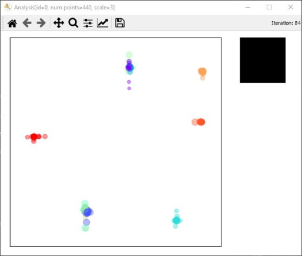
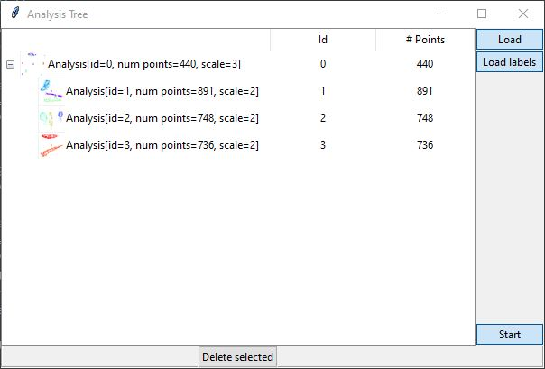

## Basic HSNE Demo

## Table of contents
1. [Purpose](#purpose)
2. [Installing](#installing)
3. [Running](#running)
4. [Usage](#usage)
5. [Demo software architecture](#architecture)
6. [Acknowledgement data sources](#data-sources)
### Purpose 

This demo illustrates the capabilities of the nptsne HSNE wrapping combined with *nptsne.hsne_analysis* classes for visual analytics support. 

The demo application is a matplotlib/tkinter based GUI illustrating the process of visual analysis using HSNE. The application is deliberately simple to permit end users more insight into the process. Key parts of the code involving nptsne.hSNE and nptsne

The user creates or loads an HSNE hierarchy using the *nptsne.HSne* class and can then navigate the HSNE model using the supporting *AnalysisModel* and *Analysis* classes in the *nptsne.hsne_analysis* sub module.

The demo is limited to the prepackaged MNIST data. For a more extensive demo, showing how to build asimple visual analytics application using PyQt5, see the ExtendedHsneDemo. 

### Installing

First unpack the data (see the README.txt in the parent directory).
Next install requirements for this demo:

```shell
> pip install -r requirements.txt
```
### Running

```shell
> python hsnedemo.py
```
#### Usage

1. Use the *Load* button to select a preformatted datafile e.g. ../data/MNIST_70000.npy
2. Use the *Load labels* button to select the corresponding label file e.g. ../data/MNIST_70000_label.npy
 
3. Press start - if there is a pre-existing hsne model file matching the data file name (e.g. ../data/MNIST_70000.hsne ) you will be prompted if you want to use it. If not a new HSNE model will be created.
4. Wait for the HSNE model to be generated (if not loading a pre-existing model) and for top level analysis embedding to appear.
5. The analysis embedding is generated using the CPU sparse tSNE. While the embedding is calculating mouse over will show which MNIST digits are in the neighborhood. After 350 iterations the embedding is regarded as complete
 
 
6. Once the tSNE embedding calculation is over select (mouse click and drag) a rectangular area including a number of landmark points. On mouse button release a new *Analysis* and embedding will start to display. Continuing this was you can create a hierarchy of *Analysis* classes in the *AnalysisModel* which are displayed in the *ModelGui*
 
  
7. Note that this simple demo is limited to calculating one embedding at a time.

### Architecture

For the benefit of developers a short summary of the demo architecture is given here.

There are two main GUI elements:

1. The ModelGui displays the load controls and the hierarchy of analyses  
2. The AnalysisGui, one or more dialogs containing the interactive embedding plot widget for an analysis and an associated viewer widget for MNIST digits corresponding to the selection.  

Once data is loaded an initial AnalysisController dialog is displayed for the top level analysis containing all the top scale points.

### Data sources

MNIST Data - retrieved from mnist-orignal.mat (https://github.com/amplab/datascience-sp14/raw/master/lab7/mldata/mnist-original.mat) a Matlab format data file derived from the original Yann LeCun MNIST data base at http://yann.lecun.com/exdb/mnist/