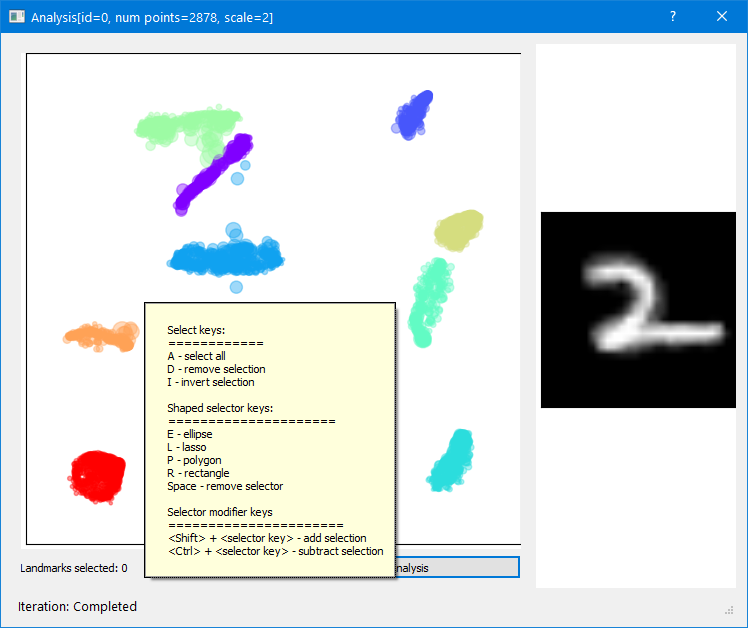
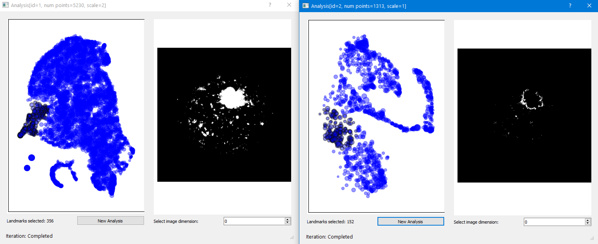
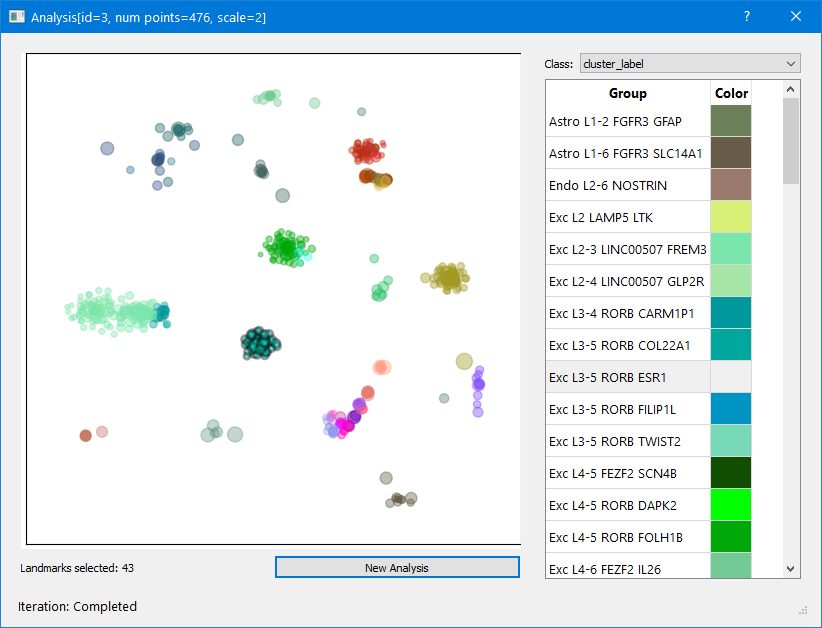

## HSNE Demo

### Purpose

This demo illustrates the capabilities of the nptsne HSNE wrapping combined with *nptsne.hsne_analysis* classes for visual analytics support. The demo application is a Qt based GUI
for the analysis of multidimensional data. It allows a user to create or load an HSNE hierarchy using the *nptsne.HSne* class and then navigate the HSNE model using the supporting *AnalysisModel* and
*Analysis* classes in the *nptsne.hsne_analysis* sub module.

A number of pre-packages demos provide a quick start to the application.

#### Installing

```shell
> # Unpack data on linux
> python ../unpack_data.py
> # or unpack data on windows
> python ..\unpack_data.py
> pip install -r requirements
```
#### Running

```shell
> python hsnedemo.py
```

#### Usage

1. Select a **MNIST 70000 digits** from the **Load preset demo** list. The data type and information concerning the demo will be loaded.
  for the demo")

2. Click **Start** and the top-level Analysis embedding will be created.

 

3. Use the select keys to start a selection operation
 

 Then click **New Analysis**.
 4. A new embedding is created for the chosen points at a more fine grained HSNE scale.

  

5. Meanwhile the ModelGui is updated to reflect the hierarchy.

   and the new analysis at the more detailed scale (1)")

6. Analyses can be brought to the front by clicking in the ModelGui. Once selected in the ModelGui and Analysis and its sub-analyses can be deleted.

7. Before loading new data restart the program.

8. Load the **Hyperspectral sun (512x512)** data. Two clusters emerge representing


the background pixels (including the corona)

  

or the photosphere

  

9. Selecting the photosphere for analysis reveals structure in the cluster allowing us to extract (using lasso selector) and examine details at further sub levels

   

10. Before loading new data restart the program.

11. Load the **MTG cell data**

12. The analysis immediately reveals multiple well separate clusters some of which have a clear link with cluster labels (select the cluster label in the table - in this case the Exc L3-5 RORB ESR1 cluster label strongle associated with the group below center)

   

13. Selection of othe label groubs and sub analyses are possible

   

##### Summary pre-packaged data

The demo come with 3 types of pre-packaged data

Demo name | Data type | Description
--- | --- | ---
MNIST 70000 digits | Image is data point | MNIST style data
MTG cell data | Point and metadata | Multidimensional points with associated metadata
Hyperspectral sun (512x512) | Hyperspectral image | Each pixel has multiple values

##### Using your own data

You can load your own data files if they correspond to one of the supported data types.
In detail these types are as follows:

###### Data types

1. __Image is a data point:__
  <br/> Single data file
  * npy file - shape = (\<number_of_images\>, \<number_of_pixels\>)
2. __Point and metadata__
  <br/>Two data files
  * npy file for point data - shape = (\<number_of_points\>, \<number_of_dimensions\>)
  * csv file containing an id followed by pairs of label + color columns
  ```
  id   label0 color0   label1 color1   ---   labelN colorN
  .    ...    ...      ...    ...      ---   ...    ...
  .    ...    ...      ...    ...      ---   ...    ...
  ```
3.  __Hyper-spectral image__
  <br/>Single data file
  * npy file - shape = (\<number_of_images\>, \<number_of_pixels\>)

A pre-calculated HSNE model can be saved and read from a file with the __.hsne__ extension.


#### Architecture

For the benefit of developers a short summary of the demo architecture is given here.

There are two main GUI elements:

1. The ModelGui displaying the load controls and the hierarchy of analyses  
2. The AnalysisController, one or more dialogs containing the interactive embedding plot widget for an analysis and an associated viewer widget for image or meta-data.  

Once data is loaded an initial AnalysisController dialog is displayed for the top level analysis containing all the top scale points.

##### Software Components

Component | Type | Function
--- | --- | ----
ModelController | Control | Creates the main Qt app and coordinates the creation of an *HSNE* analysis and the navigation of the *nptsne.hsne_analysis.AnalysisModel* and the creation of new *nptsne.hsne_analysis.Analysis* instances. Starts the *ModelGui*
ModelGui | GUI | Displays the hierarchy of *nptsne.hsne_analysis.Analysis* instances in the *AnalysisModel*. Permit deletion of analyses.
AnalysisController | Control & GUI | Controls creation of a new *nptsne.hsne_analysis.Analysis* based on a user selection. Creates an embedding for the *nptsne.hsne_analysis.Analysis*. Starts the *EmbeddingGui* to display the *nptsne.hsne_analysis.Analysis*. Next to the *EmbeddingGui* the appropriate (depending on data type) Viewer GUI is displayed
EmbeddingGui | Widget | Display an interactive scatter plot for the *nptsne.hsne_analysis.Analysis* embedding. Supports multiple selection options: <br/> &nbsp; Select brush: *Rectangle:* **R**, *Ellipse:* **E**, *Lasso:* **L**, *Polygon:* **P** *Clear* **\<space\>**<br/> &nbsp; Select function: *Select All:* **A**, *Remove Selection:* **D**, *Invert Selection:* **I** <br/> &nbsp; Select modifiers: *Add* **\<shift\>+\<key\>**, *Subtract:* **\<ctrl\>+\<key\>**
CompositeImageViewer | Widget | View an image based on a user selection in the *EmbeddingGui* where the data represents one image per point (e.g. MNIST)
HyperSpectralImageViewer | Widget | View a hyperspectral image based on selections in the *EmbeddingGui*. For Hyperspectral data.
MetaDataViewer | Widget | Table view of meta data base on user selection in the *EmbeddingGUI*
ConfigClasses | Data | Data containers for application configuration
DemoConfig | Data | The config for this application


#### Data sources

MNIST Data - retrieved from mnist-orignal.mat (https://github.com/amplab/datascience-sp14/raw/master/lab7/mldata/mnist-original.mat) a Matlab format data file derived from the original Yann LeCun MNIST data base at http://yann.lecun.com/exdb/mnist/

Hyperspectral Solar Images - downloaded from the [Solar Dynamics Observatory](http://sdo.gsfc.nasa.gov/) as in the original [Hierarchical Stochastic Neighbor Embedding](https://doi-org.tudelft.idm.oclc.org/10.1111/cgf.12878) paper.

MTG cell data - 15603 cell samples from the human middle temporal gyrus with single-nucleus transcriptomes. Data is derived from the complete set at [Allen Institute for Brain Science](https://portal.brain-map.org/atlases-and-data/rnaseq)
