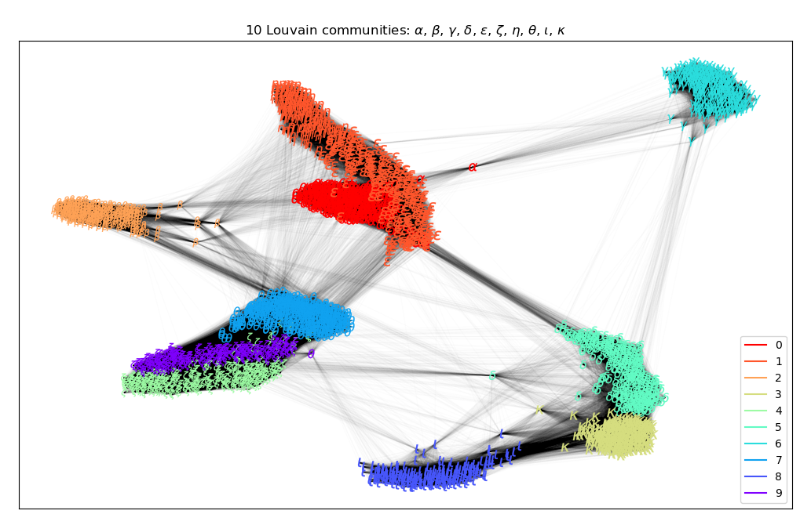

## Louvain Demo

### Purpose

The demo shows the Louvain method for community detection applied to a HSNE scale derived from 70,000 MNIST digits. The Louvain method implementation is that in [python-louvain](https://github.com/taynaud/python-louvain). The sparse transition matrix from an HSNE scale can be used to create a data graph that is amenable to Louvain analysis.

#### Installing

```shell
> # Unpack data on linux
> python ../unpack_data.py
> # or unpack data on windows
> python ..\unpack_data.py
> pip install -r requirements
```

#### Running

```shell
> python testhsnelouvain.py
```

#### Key points illustrated in the code

After loading the data and creating a 3 scale HSNE hierarchy from the MNIST data:

```python
X = np.load('MNIST_70000.npy')
lab = np.load('MNIST_70000_label.npy')
print(f'Size data: {X.shape}')
hsne = nptsne.HSne(True)
# Create a 3 scale HSNE analysis from the MNIST data
hsne.create_hsne(X, 3)
```

The transition matrix for the second scale (i.e. the top scale) is extracted

```python
scale2 = hsne.get_scale(2)
print(f'Num points in scale 2 {scale2.num_points}')
tmatrix = scale2.transition_matrix
```

The transition matrix can then be converted to a networkx Graph

```python
for r_ind, rcol in enumerate(tmatrix):
    for tup in rcol:
        if not isinstance(tup, tuple):
            continueexit()
        row.append(r_ind)
        col.append(tup[0])
        data.append(tup[1])  

def make_nxgraph_from_sparse_data(drow, dcol, weights):
    """Get igraph graph from row cols indexes and weights
    Code is adapted from scanpy utils"""

    g = nx.Graph()
    g.add_weighted_edges_from(list(zip(drow, dcol, weights)))
    return g

graph = make_nxgraph_from_sparse_data(row, col, data)
```

The Louvain community partition is calculated

```python
partition = community_louvain.best_partition(graph, resolution=0.7)
```

 and labels (Greek letters) are assigned to the partitioned clusters and the data (approximately 2800 data points) and plotted in a network spring layout

 

#### Data sources

MNIST Data - retrieved from [mnist-orignal.mat](https://github.com/amplab/datascience-sp14/raw/master/lab7/mldata/mnist-original.mat)

This Matlab format data file is derived from the original [Yann LeCun MNIST data base](http://yann.lecun.com/exdb/mnist/)
